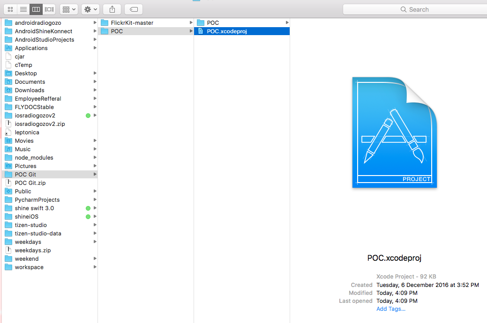
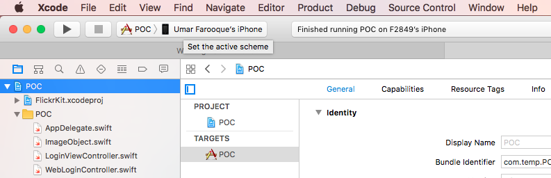
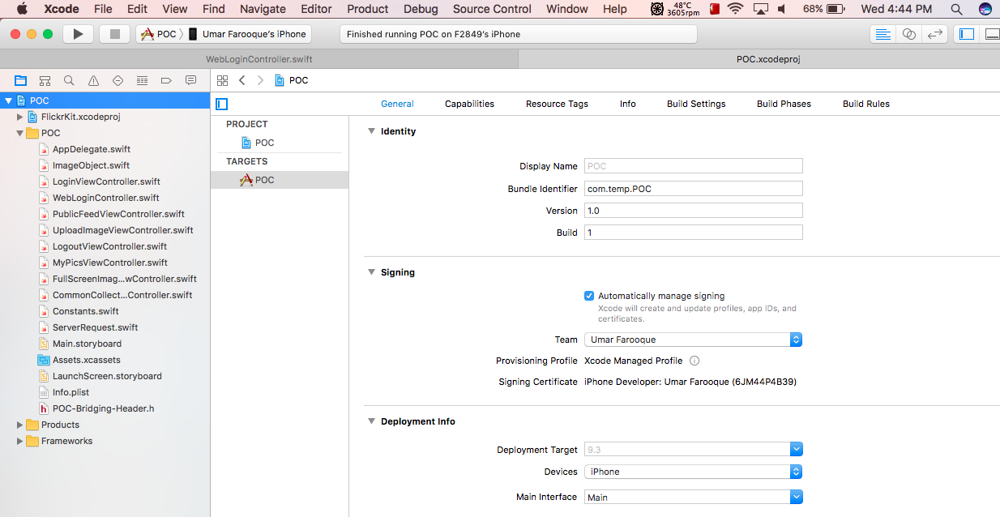

# POC

Tools used:
Xcode 8.1

Tested on iOS 10.1 and iOS 9.3.2

# Open the POC Git  folder and navigate to POC folder inside. Open POC.xcodeproject.
  
  POC Git -> POC ->  POC.xcodeproject

# When the project is open make sure to change your scheme to POC project and select the device to run as shown:

# Add proper signing to the project in order to run on device/simulator.

